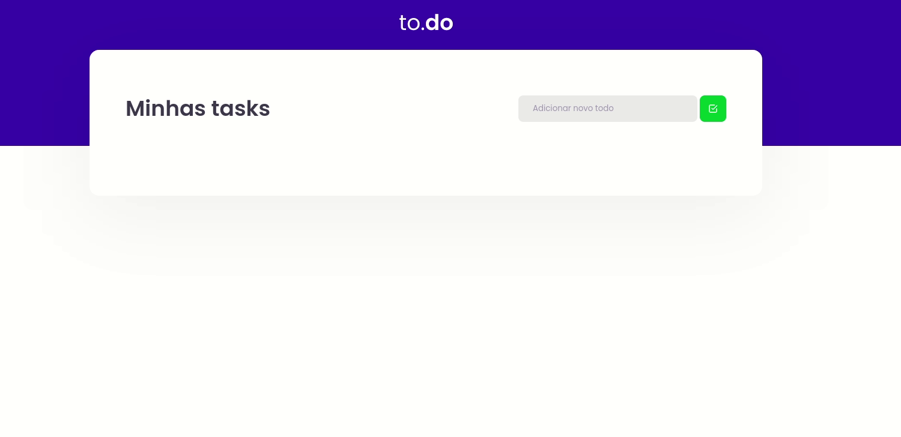

# Desafio01-trilha--react

## Sobre o desafio
O objetivo é criar uma pequena aplicação de to-do list.

## Aplicação

<h1 align="center">
    
</h1>


## Funcionalidades
* Adicionar uma nova tarefa
* Remover uma tarefa
* Marcar e desmarcar uma tarefa como concluída

## Como rodar o codigo
Clone o codigo e em seguida:
* Execute o ```yarn``` na pasta do projeto para instalar todas as dependências
* Execute o ```yarn dev``` para executar o projeto
